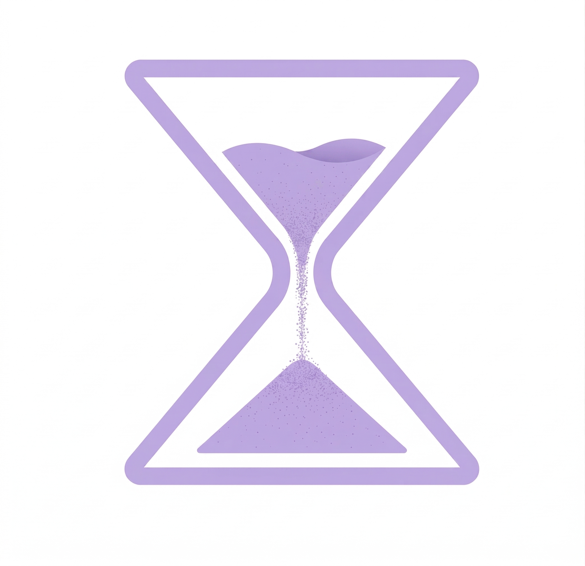

<p align="center">
  
</p>

<h1 align="center">UseTrack</h1>

<p align="center">
  macOS 本地化的个人电脑使用监控系统 — 记录你做了什么，AI 告诉你哪里可以更好。
</p>

UseTrack 是一个隐私优先的效率监控工具。Swift 后台守护进程采集你的电脑使用行为（App 切换、窗口标题、空闲时间、输入活跃度、Git/Obsidian 产出），通过 MCP 协议暴露给 Claude 等 AI 做效率分析，并自动生成每日 Obsidian 效率报告。

## 特性

### 数据采集（Swift 守护进程）
- **App 切换监听** — `NSWorkspace` 实时捕获前台应用变化
- **窗口标题追踪** — `CGWindowList` 每 5 秒轮询，检测浏览器 tab 切换、编辑器文件切换
- **空闲检测** — `CGEventSource` 检测 5 分钟无操作自动标记 idle
- **输入活跃度** — 击键/点击/滚动频率统计（**不记录按键内容**，仅计数）
- **Git 活动** — 自动扫描仓库，统计 commits 和代码行数变化
- **Obsidian 笔记** — 监听 vault 文件变更，追踪每日字数增量
- **多屏注意力归因** — 多信号融合评分模型，区分 active_focus / active_reference / passive_visible / stale

### AI 分析（Python MCP Server）
- **7 个 MCP Tools** — 直接在 Claude Code 中用自然语言查询你的活动数据
- **活动自动分类** — 规则 + URL + 窗口标题启发式，无需 LLM API 调用
- **核心指标** — 深度工作时长、上下文切换、乒乓切换、生产力比、能量曲线
- **干扰模式识别** — 频繁短切换检测、干扰源定位、低效时段分析
- **每日 Obsidian 报告** — Jinja2 模板自动生成效率报告（指标表格 + ASCII 能量曲线 + AI 建议）

### Menu Bar UI
- 实时显示深度工作时长、活跃时间、切换次数
- Top Apps 排行 + 生产力进度条
- 专注模式开关

## 架构

```
┌────────────────────────────────────────────────┐
│              用户交互层                          │
│  Menu Bar App  │  Obsidian Report  │  Claude    │
├────────────────┴──────────────────┴────────────┤
│              MCP Server (Python)               │
│  7 tools: summary/query/focus/search/output/   │
│           trends/distraction                   │
├────────────────────────────────────────────────┤
│              SQLite (WAL mode)                 │
│  activity_stream │ window_snapshot │ output_    │
│  FTS5 index      │ app_rules      │ metrics    │
├────────────────────────────────────────────────┤
│         后台采集守护进程 (Swift LaunchAgent)      │
│  AppWatcher │ WindowWatcher │ AFKWatcher │      │
│  InputWatcher │ GitWatcher │ ObsidianWatcher    │
│  AttentionScorer │ ScreenDetector │ MouseTracker│
└────────────────────────────────────────────────┘
```

## 快速开始

### 前置要求
- macOS 13+ (Ventura)
- Swift 5.10+ (Xcode Command Line Tools)
- Python 3.12+
- [uv](https://github.com/astral-sh/uv)

### 安装

```bash
# 1. 克隆仓库
git clone git@github-personal:yuanyunfan/UseTrack.git
cd UseTrack

# 2. 初始化环境
./init.sh

# 3. 编译并安装采集器
swift build -c release
cp .build/release/UseTrackCollector ~/bin/

# 4. 安装 LaunchAgent（开机自动启动）
cp config/com.usetrack.collector.plist ~/Library/LaunchAgents/
launchctl load ~/Library/LaunchAgents/com.usetrack.collector.plist

# 5. 安装 Python 依赖
cd python && uv sync
```

### 配置 MCP Server

在 `~/.claude.json` 的 `mcpServers` 中添加：

```json
{
  "usetrack": {
    "type": "stdio",
    "command": "/path/to/UseTrack/python/.venv/bin/python",
    "args": ["-m", "usetrack.mcp_server"],
    "cwd": "/path/to/UseTrack/python"
  }
}
```

重启 Claude Code 后即可使用。

### 使用

```bash
# 在 Claude Code 中直接问：
# "我今天效率怎么样？"
# "这周深度工作趋势如何？"
# "我最大的干扰源是什么？"

# 生成每日 Obsidian 报告
cd python && uv run usetrack-report

# 手动启动采集器（前台模式）
~/bin/UseTrackCollector --verbose

# 自定义路径
~/bin/UseTrackCollector \
  --db-path ~/.usetrack/usetrack.db \
  --git-paths ~/ProjectRepo,~/Work \
  --vault-path ~/Documents/NotionSync
```

### macOS 权限

| 权限 | 用途 | 必需？ |
|------|------|--------|
| **Accessibility** | 窗口标题读取 | 推荐 |
| **Screen Recording** | `CGWindowListCopyWindowInfo` 完整标题 | 推荐（启动时有检测提示） |
| **Input Monitoring** | 鼠标/键盘活跃度统计 | 可选 |

不授予权限也能运行，但部分功能（窗口标题、输入统计）会缺失。

## MCP Tools

| Tool | 功能 |
|------|------|
| `get_activity_summary` | 活动摘要：总事件数、活跃时长、Top Apps、分类分布 |
| `query_activities` | 按时间/App/分类过滤原始事件 |
| `get_focus_metrics` | 专注指标：深度工作、切换频率、乒乓切换、能量曲线 |
| `search_activity` | FTS5 全文搜索窗口标题 |
| `get_output_metrics` | 产出指标：Git commits、代码行数、Obsidian 字数 |
| `get_trends` | N 天趋势数据 |
| `get_distraction_patterns` | 干扰分析：频繁切换、娱乐时间、切换链 |

## 注意力归因模型

UseTrack 独特的多信号融合评分解决了"多屏多窗口环境下注意力在哪"的问题：

```
score(window) = 10 × keyboard_focused
              +  8 × recent_click(30s)
              +  5 × mouse_in_bounds
              +  3 × recent_scroll(60s)
              +  1 × visible_on_screen
              -  decay × seconds_since_interaction
```

| 评分 | 状态 | 含义 |
|------|------|------|
| ≥ 10 | `active_focus` | 正在使用（键盘焦点） |
| 3-10 | `active_reference` | 参考窗口（副屏文档） |
| 1-3 | `passive_visible` | 可见但未交互 |
| < 1 | `stale` | 已过期 |

## 隐私

- **所有数据本地存储**，不上传任何内容
- **不记录按键内容**，仅统计击键频率
- 敏感 App 自动跳过（1Password、Keychain 等）
- MCP Server 仅通过 stdio 本地通信
- AI 分析采用 L2 摘要模式：仅发送结构化统计（App 名+时长），不发原始窗口标题

## 技术栈

- **Swift 5.10** — 采集器 + Menu Bar UI（AppKit/SwiftUI）
- **Python 3.12** — MCP Server（FastMCP）+ AI 分析（Jinja2）
- **SQLite** — WAL 模式共享数据库 + FTS5 全文索引
- **Chrome Extension** — Manifest V3 URL 追踪

## 开发

```bash
# Swift
swift build          # 编译
swift test           # 测试

# Python
cd python
uv sync              # 安装依赖
uv run pytest        # 运行测试 (161 tests)
uv run ruff check .  # Lint
```

## License

MIT
